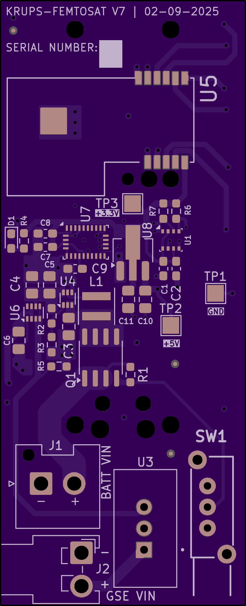

# KRUPS-FemtoSat
PCB design files and documentation for the femto-satellites used in the University of Kentucky's 2025 RockSat-XG KRUPS payload

### PCB Render

### Components
- [Raspberry Pi Pico 2 W (4MB Flash)](https://datasheets.raspberrypi.com/picow/pico-2-w-datasheet.pdf)
- [Fanstel LR62XE 1W 868/915MHz LoRa Modem](https://static1.squarespace.com/static/561459a2e4b0b39f5cefa12e/t/63ddc4b1dd728b424f1a6c23/1675478197953/LR62E_LR62XE_M262X840XE_Product+Specifications.pdf)
- [BME280 Temperature, Pressure, Humidity Sensor](https://www.bosch-sensortec.com/media/boschsensortec/downloads/datasheets/bst-bme280-ds002.pdf)
- [BNO086 9-Axis IMU](https://www.mouser.com/datasheet/2/1480/BNO080_085_Datasheet-3196201.pdf)

### Pin Mapping
| Pico 2 W GPIO Pin | Net Name |
| --- | --- |
| GPIO6 | BNO086_HINTN |
| GPIO7 | BNO086_RESET (active low)|
| GPIO8 | I2C_SDA |
| GPIO9 | I2C_SCL |
| GPIO16 | SPI_MISO |
| GPIO17 | SPI_NSS |
| GPIO18 | SPI_CLK |
| GPIO19 | SPI_MOSI |
| GPIO20 | LORA_ANTSW |
| GPIO21 | LORA_RESET (active low)|
| GPIO22 | LORA_BUSY |
| GPIO26 | LORA_DIO1 |
